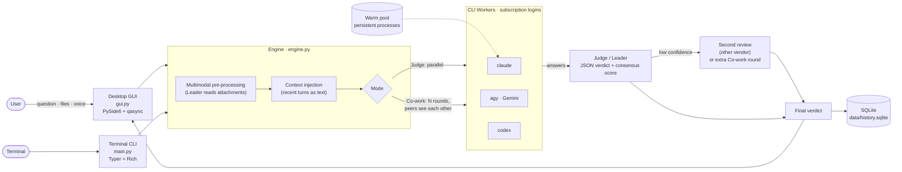

<div align="center">

# OmniCouncil

**A local-first Mixture-of-Agents desktop app for macOS.**
Ask Claude, Gemini and Codex at once. They answer or debate, and a Judge model returns one verdict with a consensus score.

[](LICENSE)


</div>

---

## Why OmniCouncil?

Different models get different things wrong. Asking several models and having a strong model judge the results catches mistakes that one model alone would miss. Doing that through APIs costs money per token. OmniCouncil does it **through the official command-line tools you're already signed in to.**

### Highlights

- **💸 Zero API cost via a CLI bridge.** Every model call is a call to an official CLI (`claude`, `codex`, `agy`) using your existing **subscription** sign-in. API keys are removed from each CLI's environment (`env_unset`), so calls are never billed to an API account by mistake.
- **⚖️ Two modes: Judge and Co-work**
  - **Judge Mode:** the workers answer in parallel without seeing each other. The Leader checks accuracy and agreement and returns a structured verdict with a **consensus score** (`1.0 🟢 / 0.5 🟡 / 0 🔴`) and a confidence level. Low confidence triggers a **second review by a model from a different vendor**.
  - **Co-work Mode:** a multi-round discussion. Each round, every worker sees the others' labelled answers and revises, adds to or keeps its own. If the Leader still rates confidence Low, it issues dispute guidance and the discussion gets extra rounds.
- **🖥️ Native macOS GUI:** a dark, minimal PySide6 interface. The final answer is the main body of each reply; the per-agent details are folded away until you open them. It also has saved chat history, follow-up questions with context, an English/Chinese interface and a global hotkey (default `⌘⇧J`).

### Also included

| | |
|---|---|
| **Warm process pool** | Persistent CLI processes skip cold starts (about 31–36% faster in end-to-end tests). Each process is reset between runs, so questions never share context. |
| **Multimodal input** | Attach images, PDFs, text or record a voice note. The Leader converts them to text first, then the workers see plain text only. |
| **Model choice per worker** | Switch any worker between fast and heavy models (for example Haiku and Opus) from a dropdown. |
| **Account & usage dashboard** | Shows each provider's sign-in status, 5-hour and 7-day usage, rate-limit alerts, and a button to log in or switch accounts. |
| **Local history** | Every run, including all Co-work rounds, is saved in SQLite and rebuilt exactly when you reopen it. |
| **CLI front end** | Everything also runs from the terminal through a Typer and Rich command-line interface. |

---

## Architecture



Every model call is a local subprocess, `argv` only (never through a shell), with its own timeout. Workers that fail (for example at a usage limit) are dropped from later rounds without blocking the others. Closing the app terminates every child process.

---

## Requirements

- **macOS.** The GUI, global hotkey and microphone recording use macOS APIs; tested on macOS 15.
- **Python 3.9+**
- **At least one of these CLIs**, installed and signed in with your subscription:

  | Provider | CLI | Sign in |
  |---|---|---|
  | Anthropic | [Claude Code](https://claude.com/claude-code) · `claude` | `claude auth login` |
  | OpenAI | [Codex CLI](https://github.com/openai/codex) · `codex` | `codex login` |
  | Google | [Antigravity](https://antigravity.google) CLI · `agy` | run `agy` once and follow the prompts |

  Any agent whose CLI is missing is skipped automatically. Two signed-in CLIs are enough to compare answers.

## Installation

```bash
git clone https://github.com/OmniCouncil/OmniCouncil.git
cd OmniCouncil

python3 -m venv .venv
source .venv/bin/activate
pip install -r requirements.txt
```

On first launch, `config.json` is created from [`config.template.json`](config.template.json). It is git-ignored, so your personal settings stay local.

## Usage

### Desktop app

```bash
python gui.py
```

- Type a question and press **Enter** (Shift+Enter for a new line).
- Use the **settings panel** to choose the mode, the workers, each worker's model, the Leader, and the second-review or extend-discussion option.
- 📎 attaches files and 🎤 records a voice note. The Leader reads them before the workers start.
- Click **Process** on any reply to see each agent's raw answer, timing and the Judge's analysis.
- Press **⌘⇧J** anywhere to bring the window to the front.

### Terminal

```bash
python main.py ask "Which is larger, 9.11 or 9.9?"            # Judge Mode
python main.py ask -m cowork -r 3 "Is a tomato a fruit?"       # Co-work Mode, 3 rounds
python main.py ask -l "Gemini 3.1 Pro" "..."                   # pick the Leader
python main.py ask --model Claude=haiku -v "..."               # override a model, print commands
python main.py ask -f invoice.png "What is the total due?"     # attachments
python main.py config --show                                   # agents, models, install status
```

---

## How the modes work

### Judge Mode

1. Every enabled worker answers on its own, in parallel.
2. The Leader receives all the answers and returns JSON:
   `{"consensus_score": 1.0 | 0.5 | 0, "confidence": "...", "analysis": "...", "final_answer": "..."}`

   | Score | Meaning |
   |---|---|
   | `1.0` 🟢 | Every agent's core answer is the same |
   | `0.5` 🟡 | A majority agrees, but at least one answer is clearly different |
   | `0` 🔴 | No majority; the answers all differ |

   If the output isn't valid JSON, it's still parsed: from code fences, by matching braces, or with regex fallbacks.
3. If confidence is **Low**, a reviewer from a **different vendor** is chosen automatically and its verdict replaces the first one.

### Co-work Mode

1. **Round 1:** independent answers.
2. **Rounds 2–N:** each worker gets the question, its own previous answer and the others' answers, labelled by source ("Claude's view: …"). It revises, adds to or keeps its answer.
3. **Leader summary:** if confidence is still **Low**, the Leader's dispute guidance becomes the focus of another round, up to `cowork_max_rounds`.

---

## Configuration

`config.json` (created from the template) controls everything. Main fields:

| Field | Description |
|---|---|
| `workers[].command` | The CLI argument list; `{prompt}` marks where the prompt goes |
| `workers[].available_models` / `selected_model` / `model_flag` | Model dropdown options; the flag is inserted right before the prompt |
| `workers[].env_unset` | Environment variables removed for this CLI only (for example `ANTHROPIC_API_KEY`, so Claude uses your subscription) |
| `*.is_persistent` | Run the agent in the warm pool (supported: `claude`; `agy` optional) |
| `leaders[].file_flag` / `file_types` | How the Leader receives attachments and which kinds it can read |
| `mode` | `judge` or `cowork` |
| `cowork_rounds` / `cowork_max_rounds` / `cowork_extend` | Co-work round settings |
| `review_on_low_confidence` | Second review in Judge Mode |
| `hotkey` | Global hotkey, for example `cmd+shift+j` or `option+space` |
| `language` | `en` or `zh` |

## Data & privacy

- **Everything stays on your machine.** History, attachments, recordings and the usage cache live in `data/`, which is git-ignored.
- **No credential files are read.** Account status comes from each CLI's own status command.
- **Workers can't change files.** Claude-based workers and Leaders run with `--tools ""`. Only during attachment pre-processing is the `Read` tool allowed, limited to the attachment folder.

## macOS permissions

- **Microphone** (voice notes): the first recording asks for permission for the app you launch OmniCouncil from (Terminal, iTerm, VS Code…). If it doesn't ask, or recordings are silent: *System Settings → Privacy & Security → Microphone*, turn that app on, and restart it.
- **Global hotkey:** uses Carbon `RegisterEventHotKey` and needs no Accessibility permission. If the key combination is already taken, choose another in `config.json`.

## Project layout

```
gui.py        Desktop app (PySide6 + qasync)
main.py       Terminal CLI (Typer + Rich)
engine.py     Orchestration: Judge / Co-work, warm pool, multimodal pre-processing, verdict parsing
config.py     Config loading, validation, migration
storage.py    SQLite history (schema v2: runs + per-round outputs)
accounts.py   Account status, usage limits, login helpers
hotkey.py     Global hotkey via Carbon (ctypes)
i18n.py       English / Chinese UI strings
```

## Limitations

- **Unofficial use of the CLIs:** OmniCouncil drives the vendors' CLIs non-interactively. Their flags and output formats can change between versions, and usage counts against your plan's limits. Please follow each provider's terms of service.
- **Uneven pool support:** `codex` has no stable persistent mode, so it always runs one-shot.
- **macOS only** for now.

## License

[MIT](LICENSE) © 2026 OmniCouncil
