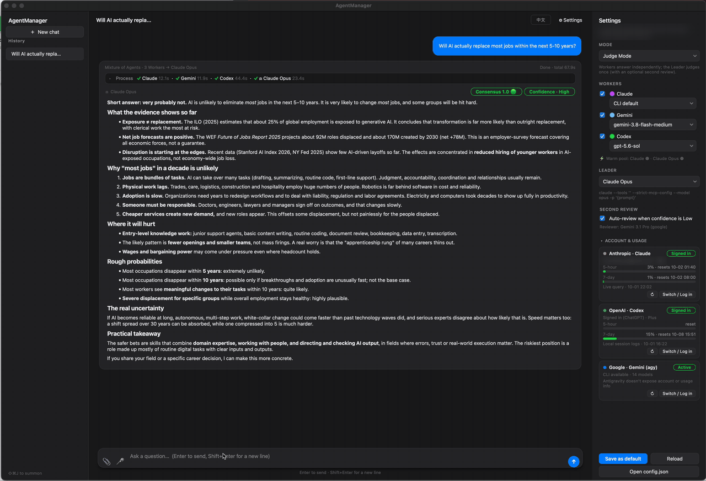
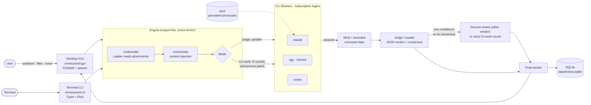

<div align="center">

# OmniCouncil



**A local-first Mixture-of-Agents desktop app for macOS.**
Ask Claude, Gemini and Codex at once. They answer independently or debate, and a Judge model returns one verdict with a measured consensus score.

[](https://github.com/OmniCouncil/OmniCouncil/actions/workflows/ci.yml)
[](LICENSE)


</div>

> [!IMPORTANT]
> OmniCouncil drives the vendors' official CLIs (`claude`, `codex`, `agy`) non-interactively, signed in with **your own** accounts. Requests count against your plan's usage limits, and each provider's terms for this kind of use differ and can change. **Check the terms of every provider you connect before using OmniCouncil.**

---

## Why OmniCouncil?

Different models get different things wrong. Asking several models and having a strong model judge the results can catch mistakes that one model alone would miss — and makes disagreement visible instead of hiding it behind one confident answer.

### Highlights

- **🔌 No separate API keys or per-token billing.** Every model call goes through an official CLI using the subscription sign-in you already have. API keys are removed from each CLI's environment (`env_unset`), so a call is never silently billed to an API account instead.
- **⚖️ Two modes: Judge and Co-work**
  - **Judge Mode:** workers answer in parallel without seeing each other. The Judge receives the answers **anonymized and shuffled**, and returns a structured verdict with a **consensus score** (`1.0 🟢 / 0.5 🟡 / 0 🔴`) and a confidence level. Low confidence *or* zero consensus triggers a **second review by a model from a different vendor**.
  - **Co-work Mode:** a multi-round discussion. Each round, every worker sees the other (anonymous) participants' answers and revises, adds to or keeps its own. If the Leader still finds a dispute, it issues guidance and the discussion gets extra rounds.
- **🖥️ Native macOS GUI.** A dark, minimal PySide6 app: the final answer is the main body of each reply, with every agent's raw answer, timing and the Judge's analysis folded away until you open them. Saved history, follow-up questions with context, attachments and voice notes, an English/Chinese interface and a global hotkey (`⌘⇧J`).

### Also included

| | |
|---|---|
| **Warm process pool** | Persistent CLI processes skip cold starts (31–36% faster end to end in our tests). Sessions are reset between runs, so questions never share context. |
| **Honest consensus** | With only one usable answer, the UI says *"Insufficient quorum · not cross-validated"* instead of showing a perfect score. |
| **Prompt-injection hygiene** | Worker answers and attachment text are passed to the Judge as length-capped, clearly delimited **untrusted data**. |
| **Multimodal input** | Images, PDFs, text and voice notes. The Leader turns them into text first; workers only see plain text. |
| **Per-worker models** | Switch any worker between fast and heavy models (e.g. Haiku ↔ Opus) from a dropdown. |
| **Account & usage dashboard** | Sign-in status, 5-hour / 7-day usage, rate-limit alerts, and a log-in / switch-account button per provider. |
| **Terminal CLI** | Everything also runs from the terminal (`omnicouncil ask …`). |

### Why not just open three chat tabs?

| | Three chat tabs | OmniCouncil |
|---|---|---|
| Ask every model | Copy-paste into each tab | One question, sent to all in parallel |
| Compare answers | You read and judge them yourself | A Judge compares them, blind and shuffled |
| See disagreement | Easy to miss | Measured consensus score, flagged in the UI |
| Second opinion | Ask another model yourself | Automatic, from a different vendor, on low confidence or no consensus |
| One model is down or rate-limited | That tab just fails | Isolated: the others continue, the failure is shown |
| Follow-ups and history | Separate per tab | One thread, saved locally, reopened exactly |
| Attachments | Upload to each tab | Parsed once by the Leader, shared as text |

### How it compares to Karpathy's llm-council

[llm-council](https://github.com/karpathy/llm-council) popularized this idea: models answer, review each other's answers anonymously, and a Chairman model writes the final answer. OmniCouncil takes a different route on a few points:

| | llm-council | OmniCouncil |
|---|---|---|
| Model access | OpenRouter API key, pay-per-token credits | Official CLIs with your existing subscriptions |
| Interface | Local web app (FastAPI + React) | Native macOS desktop app + terminal CLI |
| Review step | Every model ranks the others (anonymized) | One Judge scores consensus (anonymized, shuffled); a different-vendor reviewer on low confidence or no consensus |
| Discussion | — | Co-work mode: multi-round debate with dispute guidance |
| Speed | API calls | Warm pool of persistent CLI processes |
| Also | — | Attachments, voice, history, usage dashboard, i18n, tests + CI |
| Status | Stated by the author: "99% vibe coded", no support | Maintained; contributions welcome |

---

## Architecture



Every model call is a local subprocess, `argv` only (never through a shell), with its own timeout. Workers that fail (for example at a usage limit) are dropped from later rounds without blocking the others. Closing the app terminates every child process.

---

## Evaluation

Does asking several models and judging the results actually help? A first **pilot** on 20 randomly sampled [MMLU-Pro](https://huggingface.co/datasets/TIGER-Lab/MMLU-Pro) questions (10-option multiple choice, graded by exact match; workers: Claude Code default model, Gemini 3.8 Flash, Codex `gpt-5.6-sol`; Judge: Claude Opus):

| System | Accuracy | 95% CI | Median time / question | Model calls / question |
|---|---|---|---|---|
| Claude (best single worker) | 19/20 = 95% | 76–99% | 4.0 s | 1 |
| **Claude Opus alone** (the Judge model, no council) | 18/20 = 90% | 70–97% | 4.8 s | 1 |
| Majority vote of the three workers | 17/20 = 85% | 64–95% | 15.9 s | 3 |
| **Judge mode** | **20/20 = 100%** | 84–100% | 26.1 s | 4.1 |
| Co-work mode (first 10 questions) | 9/10 = 90% | 60–98% | 65.7 s | 9.9 |

What it suggests:
- **The council fixed both questions the Judge model got wrong on its own.** On one, all three workers agreed on the right answer and the Judge followed them. On the other, no worker was right and they disagreed completely (consensus 0); that triggered the different-vendor second review, which reached the correct answer on its own.
- **The Judge beat a plain majority vote 3 times and never overturned a correct majority.** Once it sided with a correct minority answer against two agreeing workers.
- **It costs time and calls:** ~4 model calls and ~26 s per question versus one call and a few seconds. Co-work was slower still and no more accurate here.

**This is a pilot, not proof:** with 20 questions every confidence interval overlaps, and one sample is no substitute for hundreds of questions across domains. Full results: [`evals/pilot-2026-10/`](evals/pilot-2026-10). Reproduce or extend it (uses your subscription quota):

```bash
python evals/run_eval.py --n 200 --cowork 50
python evals/run_eval.py --augment evals/results/<run>/results.jsonl   # add a "Judge model alone" baseline
```

---

## Requirements

- **macOS** (the GUI, global hotkey and voice recording use macOS APIs; tested on macOS 15).
- **Python 3.9+** (3.11+ recommended — 3.9 is past end-of-life).
- **At least one of these CLIs**, installed and signed in with your subscription:

  | Provider | CLI | Sign in |
  |---|---|---|
  | Anthropic | [Claude Code](https://claude.com/claude-code) · `claude` | `claude auth login` |
  | OpenAI | [Codex CLI](https://github.com/openai/codex) · `codex` | `codex login` |
  | Google | [Antigravity](https://antigravity.google) CLI · `agy` | run `agy` once and follow the prompts |

  Agents whose CLI is missing are skipped automatically. Two signed-in CLIs are enough to compare answers.

## Installation

**With pipx** (recommended — isolated, adds the `omnicouncil` and `omnicouncil-gui` commands):

```bash
pipx install git+https://github.com/OmniCouncil/OmniCouncil.git
omnicouncil-gui
```

**From a clone** (for development):

```bash
git clone https://github.com/OmniCouncil/OmniCouncil.git
cd OmniCouncil
python3 -m venv .venv && source .venv/bin/activate
pip install -e ".[dev]"
python gui.py            # or: omnicouncil-gui
```

**As a macOS app** (built locally with [Briefcase](https://briefcase.readthedocs.io/)):

```bash
pip install briefcase
briefcase build macOS                    # → build/omnicouncil/macos/app/OmniCouncil.app (~465 MB)
briefcase package macOS --adhoc-sign     # → a .dmg in dist/
```

The app is ad-hoc signed, not notarized: the first time, right-click it and choose **Open**. Launched from Finder, it picks up your login shell's `PATH`, so it finds the CLIs just like a terminal would.

On first launch, `config.json` is created from the bundled template. Installed via pipx, OmniCouncil keeps its files in `~/Library/Application Support/OmniCouncil`; run from a clone, it uses `./config.json` and `./data`. `OMNICOUNCIL_HOME` overrides both.

## Usage

### Desktop app

- Type a question and press **Enter** (Shift+Enter for a new line).
- The **settings panel** chooses the mode, the workers, each worker's model, the Leader, and the second-review / extend-discussion option.
- 📎 attaches files and 🎤 records a voice note; the Leader reads them before the workers start.
- Click **Process** on any reply to see each agent's raw answer, timing, the Judge's analysis and which anonymous label was which model.
- **⌘⇧J** brings the window to the front from anywhere.

### Terminal

```bash
omnicouncil ask "Which is larger, 9.11 or 9.9?"               # Judge Mode
omnicouncil ask -m cowork -r 3 "Is a tomato a fruit?"          # Co-work Mode, 3 rounds
omnicouncil ask -l "Gemini 3.1 Pro" "..."                      # pick the Leader
omnicouncil ask --model Claude=haiku -v "..."                  # override a model, print commands
omnicouncil ask -f invoice.png "What is the total due?"        # attachments
omnicouncil config --show                                      # agents, models, install status
```

(From a clone without installing, use `python main.py` instead of `omnicouncil`.)

---

## How the modes work

### Judge Mode

1. Every enabled worker answers on its own, in parallel.
2. The Judge receives the answers **anonymized ("Assistant A/B/…") and in random order**, each inside `<answer>` tags that the prompt declares untrusted. It returns JSON:
   `{"consensus_score": 1.0 | 0.5 | 0 | null, "confidence": "...", "analysis": "...", "final_answer": "..."}`

   | Score | Meaning |
   |---|---|
   | `1.0` 🟢 | Every agent's core answer is the same |
   | `0.5` 🟡 | A majority agrees, but at least one answer is clearly different |
   | `0` 🔴 | No majority; the answers all differ |
   | — | Only one answer: *insufficient quorum, not cross-validated* |

   Malformed output is still parsed: from code fences, by matching braces, or with regex fallbacks.
3. If confidence is **Low**, or the answers show **no consensus** (score 0), a reviewer from a **different vendor** is picked automatically, and its verdict replaces the first.

### Co-work Mode

1. **Round 1:** independent answers.
2. **Rounds 2–N:** each worker gets the question, its own previous answer and the other participants' answers under anonymous, per-run-stable labels, and revises, adds to or keeps its answer.
3. **Leader summary** (blind, like the Judge). If confidence is still Low or there is no consensus, the Leader's dispute guidance becomes the focus of another round, up to `cowork_max_rounds`.

---

## Configuration

`config.json` controls everything. Main fields:

| Field | Description |
|---|---|
| `workers[].command` | The CLI argument list; `{prompt}` marks where the prompt goes |
| `workers[].available_models` / `selected_model` / `model_flag` | Model dropdown options; the flag is inserted right before the prompt |
| `workers[].env_unset` | Environment variables removed for this CLI only (e.g. `ANTHROPIC_API_KEY`, so Claude uses your subscription) |
| `*.is_persistent` | Run the agent in the warm pool (supported: `claude`; `agy` optional) |
| `leaders[].file_flag` / `file_types` | How the Leader receives attachments and which kinds it can read |
| `mode` | `judge` or `cowork` |
| `cowork_rounds` / `cowork_max_rounds` / `cowork_extend` | Co-work round settings |
| `review_on_low_confidence` | Second review in Judge Mode |
| `hotkey` | Global hotkey, e.g. `cmd+shift+j` or `option+space` |
| `language` | `en` or `zh` |

**Custom prompts:** every prompt is an editable file in [`omnicouncil/prompts/`](omnicouncil/prompts) (`<name>.<lang>.md`). To change one, copy it to `<OMNICOUNCIL_HOME>/prompts/` with the same name and edit the copy; it overrides the built-in version.

## Data & privacy

- **OmniCouncil has no backend and stores its own data locally** — history, attachments, recordings and the usage cache live in `data/` (or `~/Library/Application Support/OmniCouncil/data`).
- **Your prompts, conversation context and attachment contents are still sent to the model providers you select**, through their CLIs, under those providers' privacy terms. Local storage does not mean the data never leaves your machine.
- No credential files are read: account status comes from each CLI's own status command.
- Claude-based workers and Leaders run with `--tools ""` (no file or memory writes). Only attachment pre-processing enables the `Read` tool, limited to the attachment folder.

See [SECURITY.md](SECURITY.md) for the threat model and how to report a vulnerability.

## macOS permissions

- **Microphone** (voice notes): the first recording asks for permission for the app you launch OmniCouncil from (Terminal, iTerm, VS Code…). If it doesn't ask, or recordings are silent: *System Settings → Privacy & Security → Microphone*, enable that app, and restart it.
- **Global hotkey:** uses Carbon `RegisterEventHotKey`, which needs no Accessibility permission. If the combination is taken, choose another in `config.json`.

## Development

```bash
pip install -e ".[dev]"
pytest                    # ~100 tests, all with fake CLIs — no model calls, no quota
python -m pyflakes omnicouncil tests
```

```
omnicouncil/
  orchestrate.py   Judge mode, blind answer formatting, context injection, reviewer choice
  cowork.py        Co-work mode
  multimodal.py    attachment pre-processing
  pool.py          warm pool (stream-json persistent processes)
  runner.py        one model call: pool or one-shot subprocess, structured-output adapters
  parsing.py       verdict parsing with fallbacks
  prompts.py       prompt loading (prompts/*.md, user overrides)
  config.py        config loading, validation, migration
  storage.py       SQLite history (schema v2)
  accounts.py      account status, usage limits, login helpers
  cli.py           terminal CLI · cli_render.py  rich rendering
  gui.py           desktop app · hotkey.py  global hotkey · i18n.py  UI strings
evals/run_eval.py  accuracy / latency / cost evaluation
tests/             pytest suite
```

See [CONTRIBUTING.md](CONTRIBUTING.md) before opening a pull request.

## Limitations

- **Depends on the CLIs:** their flags and output formats can change between versions; usage counts against your plan's limits. Respect each provider's terms of service.
- **Uneven pool support:** `codex` has no stable persistent mode, so it always runs one-shot.
- **macOS only** for now.

## License

[MIT](LICENSE) © 2026 OmniCouncil
